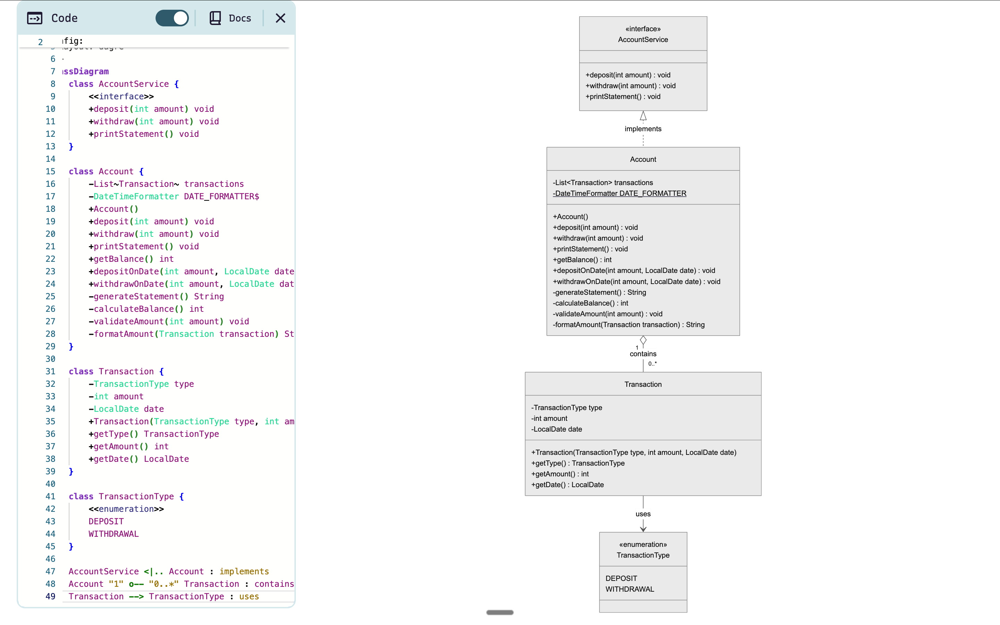

#
# Banking Service Demo

A Java-based banking application that demonstrates account management with deposit, withdrawal, and statement generation capabilities.

## Overview

This project implements a simple banking service that manages account transactions and generates account statements. It showcases clean architecture principles with interface-based design and comprehensive testing.

## Features

- **Deposit Operations**: Add funds to an account
- **Withdrawal Operations**: Remove funds from an account
- **Statement Generation**: Print formatted account statements showing transaction history
- **Transaction History**: Maintains chronological transaction records
- **Balance Tracking**: Automatic balance calculation based on transaction history
- **Date-Specific Transactions**: Support for backdating transactions for testing purposes
- **Input Validation**: Comprehensive validation with exception handling

## Project Structure

```
src/
├── main/java/com/Banking_Service/Demo/
│   ├── DemoApplication.java           # Main application entry point
│   ├── Interface/
│   │   └── AccountService.java        # Service interface
│   └── Service/
│       ├── Account.java               # Account implementation
│       ├── Transaction.java           # Transaction model
│       └── TransactionType.java       # Transaction type enum
└── test/java/com/Banking_Service/Demo/
    └── AccountTest.java               # Unit tests
```

## Technology Stack

- **Java 17**
- **Spring Boot 4.0.0**
- **Gradle** (build tool)
- **JUnit** (testing framework)

## Getting Started

### Prerequisites

- Java 17 or higher
- Gradle (or use the included Gradle wrapper)

### Building the Project

```bash
./gradlew build
```

### Running the Application

```bash
./gradlew run
```

Or run the main class directly:
```bash
java -cp build/classes/java/main com.Banking_Service.Demo.DemoApplication
```

### Running Tests

```bash
./gradlew test
```

## Usage Examples

### Example 1: Basic Operations

```java
AccountService account = new Account();
account.deposit(500);
account.withdraw(200);
account.deposit(1000);
account.printStatement();
```

**Output:**
```
Date       || Amount || Balance
[date]     || +1000  || 1300
[date]     || -200   || 300
[date]     || +500   || 500
```

### Example 2: Date-Specific Transactions

```java
Account account = new Account();
account.depositOnDate(1000, LocalDate.of(2012, 1, 10));
account.depositOnDate(2000, LocalDate.of(2012, 1, 13));
account.withdrawOnDate(500, LocalDate.of(2012, 1, 14));
account.printStatement();
```

### Example 3: Exception Handling

The application validates all inputs and throws appropriate exceptions:

```java
account.deposit(-100);  // Throws IllegalArgumentException
account.withdraw(0);    // Throws IllegalArgumentException
```

## Statement Format

Account statements are displayed in reverse chronological order (most recent first):

```
Date       || Amount || Balance
14-01-2012 || -500   || 2500
13-01-2012 || +2000  || 3000
10-01-2012 || +1000  || 1000
```

## Architecture


### Key Components

- **AccountService Interface**: Defines the contract for account operations
- **Account Class**: Implements account logic and transaction management
- **Transaction Class**: Represents individual transaction records
- **TransactionType Enum**: Defines DEPOSIT and WITHDRAWAL types

## Development

### Running in Development Mode

The project includes Spring Boot DevTools for development convenience:

```bash
./gradlew bootRun
```

## Testing

The project includes comprehensive unit tests covering:
- Deposit operations
- Withdrawal operations
- Statement generation
- Balance calculation
- Input validation
- Exception handling

## License

This project is a demonstration/educational application.

## Author

Banking Service Demo Project
